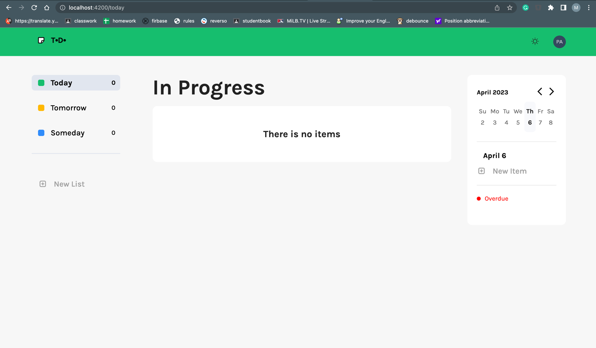
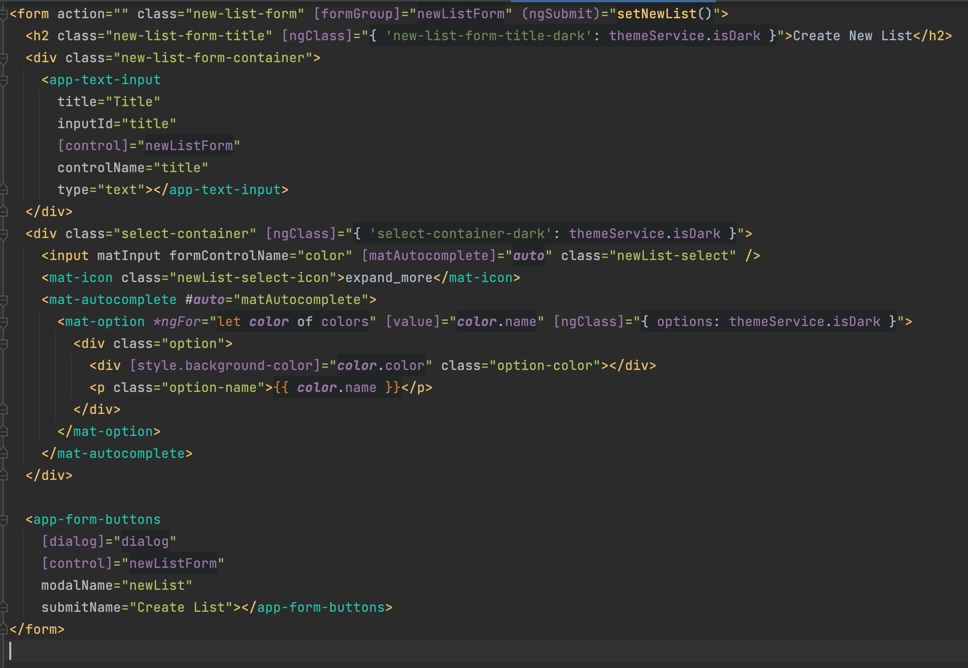
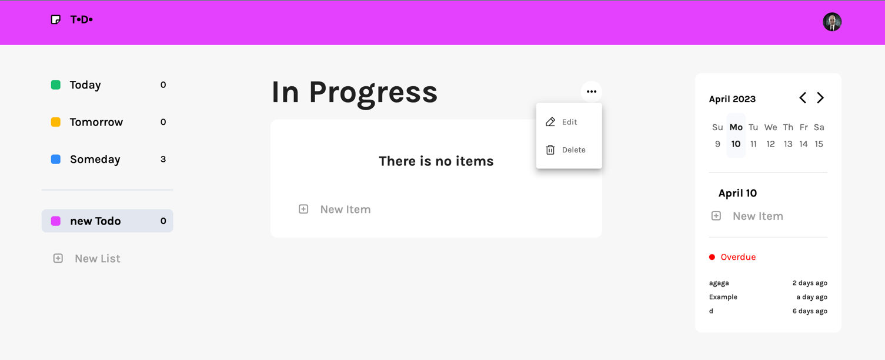
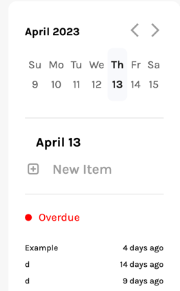

# Todo Angular

## Overview

This application demonstrates how a user can create, update, delete, and fetch data using only the frontend and
the [Squid Cloud](https://docs.squid.cloud/docs/what-is-squid) service.
For authentication, this application uses [Auth0](https://auth0.com/).

## Start

### Frontend

1.Please navigate to the todo-angular directory and proceed with installing the npm dependencies:

```
npm install
```

2. Use the command to start the application:

```
npm start
```

3. In the `src/app/app.module.ts:` we initialize Squid and the auth service:


### Backend.

Getting started with Squid Cloud involves generating a backend template project. The first step is to install the Squid Cloud CLI:

```
 npm install -g @squidcloud/cli
```

Once the Squid Cloud CLI is installed, you can generate a template project using the following command which can be copied from the application overview page in the Squid Cloud Console:

```
squid init todo-backend --appId mnhwpkfn8e8e0ozo23 --apiKey 04d39b3c-2c6d-4eab-8d23-3d11eb2e8c65
```

1. Got to the backend directory and type:

```
squid start
```

2. To connect the frontend client to the local backend, navigate to the todo-angular directory and open the `app.module.ts` file. Then, replace `us-east-1.aws` with `local`. To update the configuration and connect to the local backend:

```typescript
SquidModule.forRoot({
  appId: environment.squidAppId,
  region: 'local',
});
```

**_environment_** contains apiKeys for Squid and Auth0 in `src/environments`

## Usage

### Authentication

To establish a connection between the frontend client and the local backend, follow these steps:

1. Navigate to the todo-angular directory and open the app.module.ts file.
2. Locate the us-east-1.aws parameter and replace it with local.
3. Save the changes to update the configuration and establish a connection to the local backend.

`src/app/app.module.ts:`


When a user logs in, the **AuthService** retrieves the user's
ID token and sends it to **Squid Cloud**. This functionality is implemented in the **AccountService**, which is responsible for managing user accounts and handling authentication and authorization tasks

`src/app/services/account.service.ts:`

```typescript
export class AccountService {
  private readonly userObs: Observable<User | undefined> = this.authService.user$.pipe(
    switchMap(user => {
      if (user === undefined) return NEVER;
      if (!user) return of(undefined);
      return of({
        username: user.nickname!,
        email: user.email!,
        avatar: user.picture!,
        id: user.sub!,
      });
    }),
  );

  constructor(private readonly authService: AuthService, private readonly squid: Squid) {
    this.authService.idTokenClaims$.subscribe(idToken => {
      if (!idToken) this.authService.loginWithRedirect();
      if (idToken) {
        const rawIdToken = idToken?.__raw;
        this.squid.setAuthIdToken(rawIdToken);
      }
    });
  }
}
```

The **idTokenClaims** is an observable that returns the user's token. If the token exists, the AccountService retrieves it and sends it to the **_squid cloud service_**:

```typescript
this.squid.setAuthIdToken(idToken);
```

To work with collections, the user needs to obtain a token, which is used to protect collections on the backend. This ensures that only authenticated and authorized users can access and modify collections in the application.

**_Backend:_**

**Squid Cloud** provides a way for the client to protect data from outside access, preventing sensitive information from being exposed.
To achieve this, Squid uses the **secureCollection** decorator, which is explained in more detail in the security rules [documentation](https://docs.squid.cloud/docs/backend/security-rules/)

`src/service/example-service.ts:`

```typescript
export class ExampleService extends SquidService {
  @secureCollection('todos', 'all')
  secureTodosCollection(): boolean {
    return this.isAuthenticated();
  }
  @secureCollection('items', 'all')
  secureItemsllection(): boolean {
    return this.isAuthenticated();
  }
}
```

**'todos' and 'items'** are collections that need to be protected.
**'all'** is a method that is protected. There are 4 methods : 'read', 'write', 'update', 'delete'. And 'all' contains all of them.

It means if the unauthorized user tries to get access to one of the collections there will be an error. Only the authorized user can work with collections.

### Todo collection

After logging in, the user is directed to the main page, which provides an overview of the application's features and functionality. From the main page,
the user can access various collections and perform actions such as creating, updating, and deleting items within them:



The left sidebar on the main page contains a list of collections, including the 'Todos' collection. This collection includes default todos such as 'Today', 'Tomorrow', and 'Someday'.
The TodoService is responsible for providing the method that allows users to access collections

`src/app/services/todos.service.ts:`

```typescript
  observeDefaultCollection(): Observable<Todo[]> {
    return this.todoCollection
      .query()
      .in('title', ['Today', 'Tomorrow', 'Someday'])
      .sortBy('userId')
      .snapshots()
      .pipe(map(todos => todos.map(todo => todo.data)))
  }
```

There are two types of todos: default and user's.

#### Default collection.

Default todos are pre-existing collections of items that are created with expiration dates. These todos include items such as 'Today', 'Tomorrow', and 'Someday', and the items within each todo are organized based on their expiration date:

**Today todo:** contains items that going to be expired today.

**Tomorrow todo:** contains items that going to be expired tomorrow.

**Someday todo:** contains items that going to be expired later or already expired.

#### User's collection.

A user's collection is a custom collection that is created by the user. This collection can include any items that the user wants to organize, and can be modified and updated as needed.

By clicking the 'New List' button, the user can create a new todo using an **Angular Form** that is provided by the TodoService.


**HTML**

`src/app/shared/forms/list-form/list-form.component.html:`



`setNewList()` creates a new Todo using `createNewList()` method from todoService

`src/app/services/todos.service.ts:`

```typescript
  async createNewList(title: string, color: string): Promise<void> {
    const userId = await this.accountService.getUser();
    const listId = self.crypto.randomUUID();
    const newList: Todo = {
      id: listId,
      userId: userId?.id,
      title: title,
      color: color,
    };
    await this.todoCollection.doc(newList.id).insert(newList);
  }
```

#### Change collection

If the user wants to modify an existing element in the Todo collection, they can click the 'edit' button next to the corresponding element.
This will call the `changeTodo()` method from the TodoService, which allows the user to modify the name of the Todo.

**HTML**

`src/app/pages/todo-items/todo-items.html:`



`src/app/services/todos.service.ts:`

```typescript

  changeTodo(id: string, newTitle: string): void {
    this.todoCollection.doc(id).update({ title: newTitle });
  }
  
```

#### Delete Collection.

When the user deletes a collection, they are redirected to the 'Today' collection page:

Delete collection:

`src/app/services/todos.service.ts:`

```typescript

  deleteTodo(): void {
    if (this.currentTodo?.id) {
      this.todoCollection.doc(this.currentTodo?.id).delete();
    }
    this.router.navigate(['', 'today']);
  }

```

### Items collection:

`this.item` is a shortcut for `this.squid.collection<Item>('items')`

#### Get Items.

When the user clicks on a particular Todo, they are taken to a page displaying the Items related to that Todo. If the user clicks on one of the default todos, the items will be automatically filtered by date. To retrieve the items, the `ObserveTodoItems()` method from the ItemService is called.

`src/app/pages/todo-items/todo-items.component.html:`


`src/app/services/items.service.ts:`

```typescript
observeTodoItems(todoId: string): Observable<Item[]> {
    const today = dayjs().format('M/D/YYYY');
    const tomorrow = dayjs().add(1, 'day').format('M/D/YYYY');
    return this.accountService.observeUser().pipe(
      switchMap(user => {
        if (!user) return NEVER;
        const query = this.itemCollection.query().eq('userId', user.id);

        switch (todoId) {
          case 'today':
            query.eq('dueDate', today);
            break;
          case 'tomorrow':
            query.eq('dueDate', tomorrow);
            break;
          case 'someday':
            query.nin('dueDate', [today, tomorrow]);
            break;
          default:
            return this.itemCollection
              .query()
              .eq('todoId', todoId)
              .eq('userId', user.id)
              .snapshots()
              .pipe(map(items => items.map(item => item.data)));
        }
        return query.snapshots().pipe(map(items => items.map(item => item.data)));
      }),
    );
  }


```

#### Create Item.

When the user clicks on the 'New Item' button, a new Item for the current Todo is created using the `addNewItem()` method from the ItemService:

`src/app/services/items.service.ts:`

```typescript
    addNewItem(item: Item): void {
    this.itemCollection.doc(item.id).insert(item).then();
  }
```

#### Change Item

1. When the user clicks on the pencil icon, they can edit the item by using the `changeItem()` method from the ItemService.:


`src/app/services/items.service.ts:`

```typescript
 async changeItem(id: string, item: Item): Promise<void> {
  await this.item
  .doc(id)
  .update({ title: item.title, description: item.description, dueDate: item.dueDate, tags: item.tags });
}
```

2. By clicking the checkbox, the user can change the status of the item from active to complete:

```typescript
  async changeItemStatus(id: string): Promise<void> {
    const currentItem = await this.item.doc(id).snapshot();
    await this.item.doc(id).update({ completed: !currentItem?.data.completed });
  }
```

#### Delete Item.

If the user deletes a Todo, all items related to that Todo are automatically deleted.
Additionally, the user can manually delete an item by clicking the delete button on the calendar sidebar:


`src/app/services/items.service.ts:`

```typescript
  deleteItem(id?: string): void {
    if (id) this.item.doc(id).delete();
  }
```

### Calendar

If there are no items related to a particular date, the "New Item" button will appear, allowing the user to add new items to the selected date.


get Items by date:

`src/app/services/items.service.ts:`

```typescript
  observeItemsSortedByDate(date: string): Observable<Item[] | []> {
    return this.accountService.observeUser().pipe(
      switchMap(user => {
        if (!user) return NEVER;
        return this.itemCollection
          .query()
          .eq('userId', user.id)
          .eq('dueDate', date)
          .snapshots()
          .pipe(map(items => items.map(item => item.data)));
      }),
    );
  }

```

There is a list of expired items below the 'active items' section. These items have already passed their expiration date:


