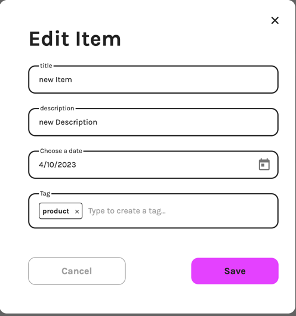
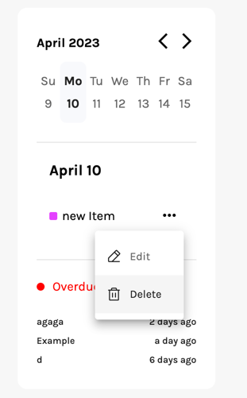

# Todo Angular

## Overview

this application demonstrates how user can create, update, delete and fetch data using only frontend and
[squid cloud service](https://docs.squid.cloud/docs/what-is-squid).
For authentication this application use [auth0](https://auth0.com/).

## Start

1. To install dependencies:

   **npm install**

2. to run application:

   **npm start**

3. In the app.module.ts we connected squid service and auth service:

**_src/app/app.module.ts:_**


**_environment_** contains apiKeys for squid and Auth0 in src/environments

## Usage

### Authentication

To get the access to the app user has to log in. Auth0 allows user to log in with Google. Auth0 provides **_AuthGuard_** so we can protect our routes.

**src/app/app.module.ts:**


If user logged in **_AuthService_** gets user's id token and send it to **_squid cloud_**.
That logic is implemented inside the **_AccountService_**.

**_src/app/services/account.service.ts:_**


**idTokensClaims** is an observable that return user's token. If token exists accountService get this token and send it to the **_squid cloud service_** using:

`this.squid.setAuthIdToken(idToken);`

User needs to get token, so they can work with collections. Collection are protected on the backend side.

**_bakcend:_**


### Todo collection

when user is logged in they get to the main page:


Left sidebar contains list of Todos collection. 'Today', 'Tomorrow', 'Someday' todos ara default todos. Method that allows user to get collections is located in todo.service.ts

**_src/app/services/todos.service.ts:_**

```
  getDefaultCollection(): Observable<Todo[]> {
    return this.todoCollection
      .query()
      .where('title', 'in', ['Today', 'Tomorrow', 'Someday'])
      .sortBy('userId')
      .snapshots()
      .pipe(map(todos => todos.map(todo => todo.data)));
  }
```

There are two types of todos: default and user's.

#### Default collection.

Default todos are a todos that are already created and contain items according to expiration date:

**Today todo:** contains items that going to be expired today.

**Tomorrow todo:** contains items that going to be expired tomorrow.

**Someday todo:** contains items that going to be expired later or already expired.

#### User's collection.

User's collection is a collection that is created by user.

pushing the 'New List' button user can create new todo using **Angular Form** todoService.


**HTML**

**_src/app/shared/forms/list-form/list-form.component.html:_**


setNewList() creates a new Todo using createNewList() method from todoService

**_src/app/services/todos.service.ts:_**

```
  async createNewList(title: string, color: string): Promise<void> {
    const userId = await this.accountService.getUser();
    const listId = self.crypto.randomUUID();
    const newList: Todo = {
      id: listId,
      userId: userId?.id,
      title: title,
      color: color,
    };
    await this.todoCollection.doc(newList.id).insert(newList);
  }
```

#### Change collection

To change current element of the Todo collection user can push 'edit-button' and then change the name using changeTodo() method from TodosService:

**HTML**

**_src/app/pages/todo-items/todo-items.html:_**


**_src/app/services/todos.service.ts:_**

```

  changeTodo(id: string, newTitle: string): void {
    this.todoCollection.doc(id).update({ title: newTitle });
  }
```

#### Delete Collection.

When user deletes collection they follow to the 'Today' collection page:

Delete collection:

**_src/app/services/todos.service.ts:_**

```

  deleteTodo(): void {
    if (this.currentTodo?.id) {
      this.todoCollection.doc(this.currentTodo?.id).delete();
    }
    this.router.navigate(['', 'today']);
  }

```

### Items collection:

**this.item** is a shortcut for `this.squid.collection<Item>('items')`

#### Get Items.

Clicking on the particular Todo leads user on the page with Items that are related to this todo. If user clicks on one of the default todos items will be filtered by date.
To get items:

**_src/app/pages/todo-items/todo-items.component.html:_**


**_src/app/services/items.service.ts:_**

```angularts

getItemsFromCurrentTodo(todoId: string): Observable<Item[]> {
    const today = moment().format('M/D/YYYY');
    const tomorrow = moment().add(1, 'day').format('M/D/YYYY');
    return this.accountService.observeUser().pipe(
      switchMap(user => {
        if (!user) return NEVER;
        const query = this.item.query().where('userId', '==', user.id);

        switch (todoId) {
          case 'today':
            query.where('dueDate', '==', today);
            break;
          case 'tomorrow':
            query.where('dueDate', '==', tomorrow);
            break;
          case 'someday':
            query.where('dueDate', 'not in', [today, tomorrow]);
            break;
          default:
            return this.item
              .query()
              .where('todoId', '==', todoId)
              .where('userId', '==', user.id)
              .snapshots()
              .pipe(
                map(items =>
                  items.map(item => {
                    return item.data;
                  }),
                ),
              );
        }
        return query.snapshots().pipe(map(items => items.map(item => item.data)));
      }),
    );
  }
```

#### Create Item.

By pushing on the 'New Item' button a user will create a new Item for Todo on the page the user is currently located using addNewItem() method from itemService:

**_src/app/services/items.service.ts:_**

```
  addNewItem(item: Item): void {
    this.item.doc(item.id).insert(item);
  }
```

#### Change Item

1. By clicking on pencil user can change item using changeItem() method from itemService:




**_src/app/services/items.service.ts:_**

```
 async changeItem(id: string, item: Item): Promise<void> {
  await this.item
  .doc(id)
  .update({ title: item.title, description: item.description, dueDate: item.dueDate, tags: item.tags });
}
```

2. Clicking the checkbox user can change status of item from active to complete:

```
  async changeItemStatus(id: string): Promise<void> {
    const currentItem = await this.item.doc(id).snapshot();
    await this.item.doc(id).update({ completed: !currentItem?.data.completed });
  }
```

#### Delete Item.

If user deletes Todo they automatically delete all items that are related to this todo. Also, user can manually delete item by clicking on the delete button on the calendar sidebar:



**_src/app/services/items.service.ts:_**

```
  deleteItem(id?: string): void {
    if (id) this.item.doc(id).delete();
  }
```

### Calendar

On the calendar user can see items filtered by date of expiration. By clicking on the particular date user will see all items related to this date.
If there is no item 'New Item' button will appear.


get Items by date:

**_src/app/services/items.service.ts:_**

```
  getItemByDate(date: string): Observable<Item[] | []> {
    return this.accountService.observeUser().pipe(
      switchMap(user => {
        if (!user) return NEVER;
        return this.item
          .query()
          .where('userId', '==', user.id)
          .where('dueDate', '==', date)
          .snapshots()
          .pipe(map(items => items.map(item => item.data)));
      }),
    );
  }
```


There is a list of expired items Below the 'active items' section
