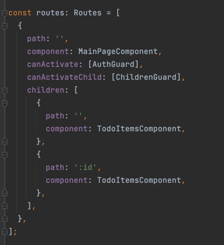
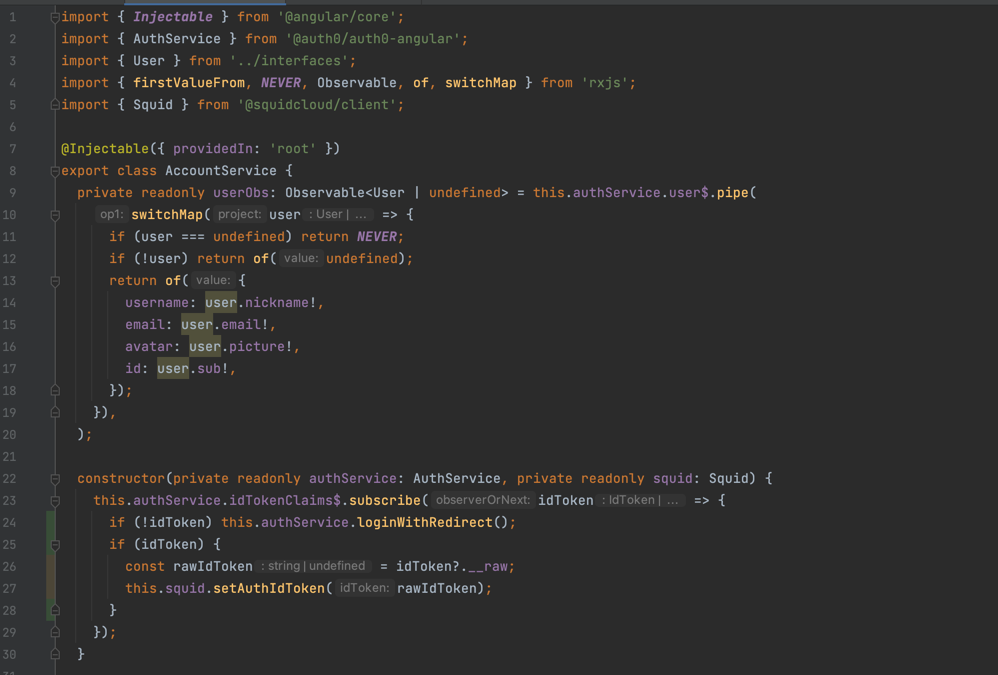
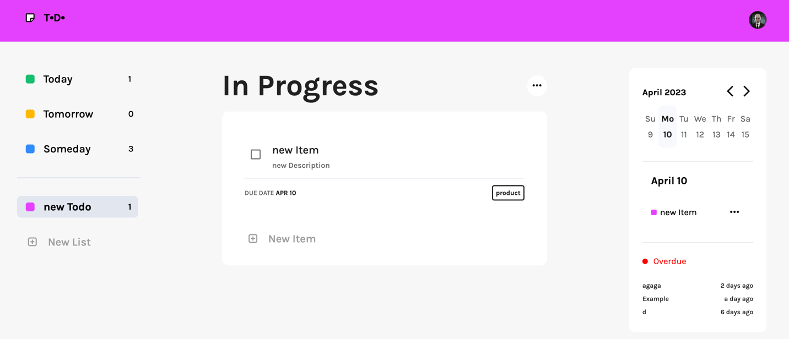
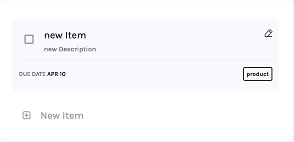

# Todo Angular

## Overview

This application demonstrates how a user can create, update, delete, and fetch data using only the frontend and
[squid cloud](https://docs.squid.cloud/docs/what-is-squid) service.
For authentication, this application uses [auth0](https://auth0.com/).

## Start
### Frontend
1. Go to frontend folder and install dependencies:

   **npm install**

2. to run application:

   **npm start**

3. In the app.module.ts file, we imported and connected the SquidService and AuthService. These services handle authentication and data retrieval for the application:

**_src/app/app.module.ts:_**


### Backend.

backend is deployed on the squid by default. To run locally:
1. Got to the backend folder and type:

```squid start```
2. To connect the local backend to the frontend, navigate to the frontend folder and open the app.module.ts file. Then, replace the 'us-east-1.aws' value with 'local' to update the configuration and connect to the local backend:
```
    SquidModule.forRoot({
      appId: environment.squidAppId,
      region: 'local',
    }),
```

**_environment_** contains apiKeys for squid and Auth0 in src/environments

## Usage

### Authentication

In order to access the app, a user must log in. We use **Auth0** to enable users to log in with Google. **Auth0** also provides the AuthGuard feature, which allows us to protect our routes and ensure that only authenticated users can access certain parts of the app:

**src/app/app.module.ts:**



When a user logs in, the **AuthService** retrieves the user's
ID token and sends it to **Squid Cloud**. This functionality is implemented in the **AccountService**, which is responsible for managing user accounts and handling authentication and authorization tasks

**_src/app/services/account.service.ts:_**



The **idTokenClaims** is an observable that returns the user's token. If the token exists, the AccountService retrieves it and sends it to the **_squid cloud service_**:

`this.squid.setAuthIdToken(idToken);`

To work with collections, the user needs to obtain a token, which is used to protect collections on the backend. This ensures that only authenticated and authorized users can access and modify collections in the application.

*_backend:_*

**Squid cloud** provides a way for the client to protect data from outside access, preventing sensitive information from being exposed.
To achieve this, Squid uses the **secureCollection** decorator, which is explained in more detail in the security rules [documentation](https://docs.squid.cloud/docs/backend/security-rules/)
 
***src/service/example-service.ts:***
```
export class ExampleService extends SquidService {
  @secureCollection("todos", "all")
  secureTodosCollection(): boolean {
    return this.isAuthenticated();
  }
  @secureCollection("items", "all")
  secureItemsllection(): boolean {
    return this.isAuthenticated();
  }
}

```
**'todos' and 'items'** are collections that need to be protected.
**'all'** is a method that is protected. There are 4 methods : 'read','write','update','delete'. And 'all' contains all of them.

It means if the unauthorized user tries to get access to one of the collections there will be an error. Only the authorized user can work with collections.
### Todo collection


After logging in, the user is directed to the main page, which provides an overview of the application's features and functionality. From the main page,
the user can access various collections and perform actions such as creating, updating, and deleting items within them:


The left sidebar on the main page contains a list of collections, including the 'Todos' collection. This collection includes default todos such as 'Today', 'Tomorrow', and 'Someday'.
The TodoService is responsible for providing the method that allows users to access collections

**_src/app/services/todos.service.ts:_**

```
  getDefaultCollection(): Observable<Todo[]> {
    return this.todoCollection
      .query()
      .where('title', 'in', ['Today', 'Tomorrow', 'Someday'])
      .sortBy('userId')
      .snapshots()
      .pipe(map(todos => todos.map(todo => todo.data)));
  }
```

There are two types of todos: default and user's.

#### Default collection.

Default todos are pre-existing collections of items that are created with expiration dates. These todos include items such as 'Today', 'Tomorrow', and 'Someday', and the items within each todo are organized based on their expiration date:

**Today todo:** contains items that going to be expired today.

**Tomorrow todo:** contains items that going to be expired tomorrow.

**Someday todo:** contains items that going to be expired later or already expired.

#### User's collection.

A user's collection is a custom collection that is created by the user. This collection can include any items that the user wants to organize, and can be modified and updated as needed.

BBy clicking the 'New List' button, the user can create a new todo using an **Angular Form** that is provided by the TodoService.


**HTML**

**_src/app/shared/forms/list-form/list-form.component.html:_**


setNewList() creates a new Todo using createNewList() method from todoService

**_src/app/services/todos.service.ts:_**

```
  async createNewList(title: string, color: string): Promise<void> {
    const userId = await this.accountService.getUser();
    const listId = self.crypto.randomUUID();
    const newList: Todo = {
      id: listId,
      userId: userId?.id,
      title: title,
      color: color,
    };
    await this.todoCollection.doc(newList.id).insert(newList);
  }
```

#### Change collection

If the user wants to modify an existing element in the Todo collection, they can click the 'edit' button next to the corresponding element.
This will call the changeTodo() method from the TodoService, which allows the user to modify the name of the Todo.

**HTML**

**_src/app/pages/todo-items/todo-items.html:_**


**_src/app/services/todos.service.ts:_**

```

  changeTodo(id: string, newTitle: string): void {
    this.todoCollection.doc(id).update({ title: newTitle });
  }
```

#### Delete Collection.

When the user deletes a collection, they are redirected to the 'Today' collection page:

Delete collection:

**_src/app/services/todos.service.ts:_**

```

  deleteTodo(): void {
    if (this.currentTodo?.id) {
      this.todoCollection.doc(this.currentTodo?.id).delete();
    }
    this.router.navigate(['', 'today']);
  }

```

### Items collection:

**this.item** is a shortcut for `this.squid.collection<Item>('items')`

#### Get Items.

When the user clicks on a particular Todo, they are taken to a page displaying the Items related to that Todo. If the user clicks on one of the default todos, the items will be automatically filtered by date. To retrieve the items, the getItems() method from the TodoService is called.

**_src/app/pages/todo-items/todo-items.component.html:_**



**_src/app/services/items.service.ts:_**

```angularts

getItemsFromCurrentTodo(todoId: string): Observable<Item[]> {
    const today = moment().format('M/D/YYYY');
    const tomorrow = moment().add(1, 'day').format('M/D/YYYY');
    return this.accountService.observeUser().pipe(
      switchMap(user => {
        if (!user) return NEVER;
        const query = this.item.query().where('userId', '==', user.id);

        switch (todoId) {
          case 'today':
            query.where('dueDate', '==', today);
            break;
          case 'tomorrow':
            query.where('dueDate', '==', tomorrow);
            break;
          case 'someday':
            query.where('dueDate', 'not in', [today, tomorrow]);
            break;
          default:
            return this.item
              .query()
              .where('todoId', '==', todoId)
              .where('userId', '==', user.id)
              .snapshots()
              .pipe(
                map(items =>
                  items.map(item => {
                    return item.data;
                  }),
                ),
              );
        }
        return query.snapshots().pipe(map(items => items.map(item => item.data)));
      }),
    );
  }
```

#### Create Item.

When the user clicks on the 'New Item' button, a new Item for the current Todo is created using the addNewItem() method from the ItemService:

**_src/app/services/items.service.ts:_**

```
  addNewItem(item: Item): void {
    this.item.doc(item.id).insert(item);
  }
```

#### Change Item

1. When the user clicks on the pencil icon, they can edit the item by using the changeItem() method from the ItemService.:




**_src/app/services/items.service.ts:_**

```
 async changeItem(id: string, item: Item): Promise<void> {
  await this.item
  .doc(id)
  .update({ title: item.title, description: item.description, dueDate: item.dueDate, tags: item.tags });
}
```

2. By clicking the checkbox, the user can change the status of the item from active to complete:

```
  async changeItemStatus(id: string): Promise<void> {
    const currentItem = await this.item.doc(id).snapshot();
    await this.item.doc(id).update({ completed: !currentItem?.data.completed });
  }
```

#### Delete Item.

If the user deletes a Todo, all items related to that Todo are automatically deleted.
Additionally, the user can manually delete an item by clicking the delete button on the calendar sidebar:


**_src/app/services/items.service.ts:_**

```
  deleteItem(id?: string): void {
    if (id) this.item.doc(id).delete();
  }
```

### Calendar

If there are no items related to a particular date, the "New Item" button will appear, allowing the user to add new items to the selected date.


get Items by date:

**_src/app/services/items.service.ts:_**

```
  getItemByDate(date: string): Observable<Item[] | []> {
    return this.accountService.observeUser().pipe(
      switchMap(user => {
        if (!user) return NEVER;
        return this.item
          .query()
          .where('userId', '==', user.id)
          .where('dueDate', '==', date)
          .snapshots()
          .pipe(map(items => items.map(item => item.data)));
      }),
    );
  }
```


There is a list of expired items below the 'active items' section. These items have already passed their expiration date
