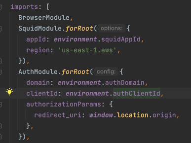
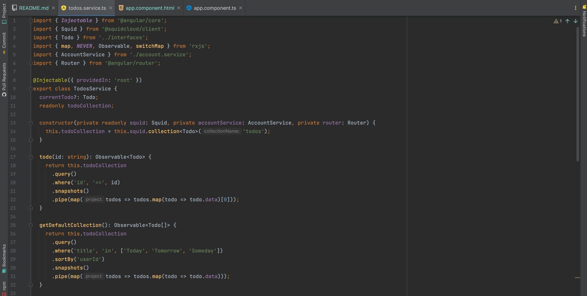
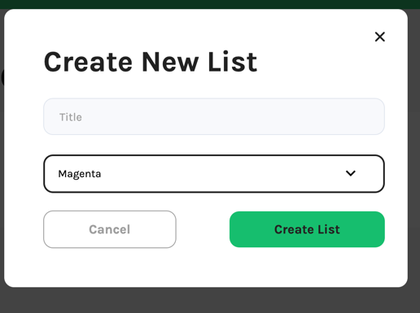

# Todo Angular

## Overview

this application demonstrates how user can create, update, delete and fetch data using only frontend and 
[squid cloud service](https://docs.squid.cloud/docs/what-is-squid).
For authentication this application use [auth0](https://auth0.com/).

## Start

1. To install dependencies:

    **npm install**

2. to run application:

     **npm start**

3.  In the app.module.ts we connected squid service and auth service:

***src/app/app.module.ts:***

  ***environment*** contains apiKeys for squid and Auth0 in src/environments

## Usage

### Authentication
 To get the access to the app user has to log in. Auth0 allows user to log in with Google. Auth0 provides ***AuthGuard*** so we can protect our routes.

**src/app/app.module.ts:**

If user  logged in ***AuthService*** gets user's id token and send it to ***squid cloud***. 
That logic is implemented inside the ***AccountService***.

***src/app/services/account.service.ts:***

**idTokensClaims** is an observable that return user's token. If token  exists accountService get this token and send it to the ***squid cloud service*** using:

`this.squid.setAuthIdToken(idToken);`

User needs to get token, so they can work with collections. Collection are protected on the backend side.

***bakcend:***

### Todo collection
 when user is logged in they get to the main page:

Left sidebar contains list of Todos collection. 'Today', 'Tomorrow', 'Someday' todos ara default todos. Method that allows user to get collections is located in todo.service.ts

***src/app/services/todos.service.ts:***

There are two types of todos: default and user's.

#### Default collection.

 Default todos are a todos that are already created  and contain items according to expiration date:

 **Today todo:** contains items that going to be expired today.

 **Tomorrow todo:** contains items that going to be expired tomorrow.

 **Someday todo:** contains items that going to be expired later or already expired.

#### User's collection.

User's collection is a collection that is created by user.

pushing the 'New List' button user can create new todo using **Angular Form** todoService.

